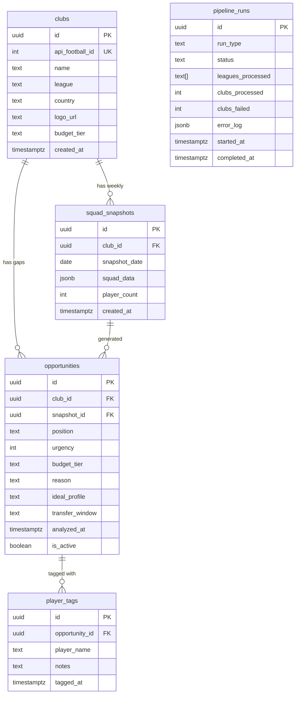

# Data Foundation & Gemini Analysis Pipeline

## Overview

Build the backend data infrastructure for FFA Scout Board: connect to API-Football for live squad data, store it in Supabase, and run AI-powered squad gap analysis via Gemini 2.5 Flash. This covers BUILD.md Days 1-4, split into two execution phases sized for ~80K token sessions.

## Problem Statement / Motivation

Free Football Agency (Levan Seturidze, CEO) needs to identify transfer opportunities across 120-150 European clubs in 6 leagues. Currently the app only has hardcoded sample data for 12 clubs and a Claude-based analyzer. To deliver real value, we need:

1. **Live data** from API-Football refreshed weekly
2. **Persistent storage** in Supabase (replacing JSON file cache)
3. **Cost-effective AI analysis** via Gemini 2.5 Flash ($2-5/week vs Claude's higher cost)
4. **Reliability** with resume-capable scripts, per-club transaction safety, and fallback heuristics

## Proposed Solution

Two execution phases, each fitting within an ~80K token Claude Code session:

- **Phase 1 (Data Foundation):** Project scaffold, Supabase schema, API-Football integration, data-fetch script with resume capability
- **Phase 2 (Gemini Pipeline):** Gemini 2.5 Flash integration, batch analysis with per-club soft-delete, output validation, accuracy testing

## Technical Approach

### Architecture

```
scripts/fetch-squads.js (cron: Monday 3 AM)
    │
    ├── lib/api-football.js ──→ API-Football (RapidAPI)
    │                              GET /v3/teams?league={id}&season={season}
    │                              GET /v3/players/squads?team={team_id}
    │
    ├── lib/supabase.js ──→ Supabase (PostgreSQL)
    │                          clubs, squad_snapshots tables
    │
    └── lib/gemini-analyzer.js ──→ Gemini 2.5 Flash API
                                     Batches of 20-30 clubs
                                     → opportunities table
```

### Database Schema (Improved from BUILD.md)

```sql
-- Clubs we're monitoring
CREATE TABLE clubs (
  id UUID PRIMARY KEY DEFAULT gen_random_uuid(),
  api_football_id INTEGER UNIQUE NOT NULL,
  name TEXT NOT NULL,
  league TEXT NOT NULL,
  country TEXT NOT NULL,
  logo_url TEXT,
  budget_tier TEXT DEFAULT 'mid' CHECK (budget_tier IN ('low', 'mid', 'high')),
  created_at TIMESTAMPTZ DEFAULT NOW()
);

-- Raw squad data (refreshed weekly)
CREATE TABLE squad_snapshots (
  id UUID PRIMARY KEY DEFAULT gen_random_uuid(),
  club_id UUID REFERENCES clubs(id) ON DELETE CASCADE,
  snapshot_date DATE NOT NULL,
  squad_data JSONB NOT NULL,
  player_count INTEGER,
  created_at TIMESTAMPTZ DEFAULT NOW(),
  UNIQUE(club_id, snapshot_date)
);

-- AI-generated opportunity analysis
CREATE TABLE opportunities (
  id UUID PRIMARY KEY DEFAULT gen_random_uuid(),
  club_id UUID REFERENCES clubs(id) ON DELETE CASCADE,
  snapshot_id UUID REFERENCES squad_snapshots(id) ON DELETE SET NULL,
  position TEXT NOT NULL,
  urgency INTEGER NOT NULL CHECK (urgency BETWEEN 1 AND 3),
  budget_tier TEXT NOT NULL CHECK (budget_tier IN ('low', 'mid', 'high')),
  reason TEXT NOT NULL,
  ideal_profile TEXT,
  transfer_window TEXT,
  analyzed_at TIMESTAMPTZ DEFAULT NOW(),
  is_active BOOLEAN DEFAULT TRUE
);

-- Levan's player-opportunity matches
CREATE TABLE player_tags (
  id UUID PRIMARY KEY DEFAULT gen_random_uuid(),
  opportunity_id UUID REFERENCES opportunities(id) ON DELETE CASCADE,
  player_name TEXT NOT NULL,
  notes TEXT,
  tagged_at TIMESTAMPTZ DEFAULT NOW(),
  UNIQUE(opportunity_id, player_name)
);

-- Pipeline execution log
CREATE TABLE pipeline_runs (
  id UUID PRIMARY KEY DEFAULT gen_random_uuid(),
  run_type TEXT NOT NULL CHECK (run_type IN ('fetch', 'analyze')),
  status TEXT NOT NULL CHECK (status IN ('running', 'completed', 'failed', 'partial')),
  leagues_processed TEXT[],
  clubs_processed INTEGER DEFAULT 0,
  clubs_failed INTEGER DEFAULT 0,
  error_log JSONB,
  started_at TIMESTAMPTZ DEFAULT NOW(),
  completed_at TIMESTAMPTZ
);

-- Indexes
CREATE INDEX idx_opportunities_active ON opportunities(is_active, club_id);
CREATE INDEX idx_opportunities_club ON opportunities(club_id);
CREATE INDEX idx_squad_snapshots_club_date ON squad_snapshots(club_id, snapshot_date DESC);
CREATE INDEX idx_pipeline_runs_type_status ON pipeline_runs(run_type, status);
```

**Key improvements over BUILD.md schema:**

| Change | Why |
|--------|-----|
| `CHECK` constraints on `budget_tier` | Prevents AI returning "medium" instead of "mid" |
| `UNIQUE(club_id, snapshot_date)` on snapshots | Prevents duplicate snapshots on same day |
| `snapshot_id` FK on opportunities | Auditability — trace which data produced each opportunity |
| `ON DELETE CASCADE` on FKs | Clean cascade when removing clubs |
| `UNIQUE(opportunity_id, player_name)` on tags | Prevents duplicate tags |
| `pipeline_runs` table | Monitoring — know when cron succeeded/failed |
| `player_count` on snapshots | Quick validation of data completeness |
| Renamed `ideal_age_range` to `ideal_profile` | Matches existing code and is more flexible |

### Implementation Phases

#### Phase 1: Data Foundation (~50-60K tokens)

**Deliverables:**
- Initialized Next.js project with all dependencies
- Supabase schema deployed
- `lib/supabase.js` — Supabase client helper
- `lib/api-football.js` — API-Football wrapper with rate limiting
- `scripts/fetch-squads.js` — Resume-capable data fetch script
- Updated `.env.local.example` with all required vars
- `.gitignore` with `.env.local` protected
- Updated `lib/sample-data.js` with Italian leagues added

**Task breakdown:**

```
1. Project Initialization
   ├── npx create-next-app@14 (App Router, Tailwind, ESM)
   ├── Install: @supabase/supabase-js, @anthropic-ai/sdk
   ├── Create .gitignore (include .env.local, node_modules, .next, data/)
   ├── Create .env.local.example with all var names
   ├── git init + initial commit
   └── ~10K tokens

2. Supabase Setup
   ├── Create lib/supabase.js (client helper, server + browser clients)
   ├── SQL migration file: supabase/migrations/001_initial_schema.sql
   ├── Include all tables, constraints, indexes from schema above
   └── ~10K tokens

3. API-Football Integration
   ├── Create lib/api-football.js
   │   ├── getTeamsByLeague(leagueId, season) — GET /v3/teams
   │   ├── getSquad(teamId) — GET /v3/players/squads
   │   ├── Request counter (track against daily limit)
   │   ├── Rate limiter (max 10 req/minute to be safe)
   │   ├── Response validation (check for empty squads, null fields)
   │   └── Transform API-Football response → sample-data.js shape
   ├── Update lib/sample-data.js TARGET_LEAGUES
   │   └── Add Serie A (id: 135) and Serie B (id: 136)
   └── ~15K tokens

4. Data Fetch Script
   ├── Create scripts/fetch-squads.js
   │   ├── Accept --league flag for single-league testing
   │   ├── Accept --resume flag to continue from last checkpoint
   │   ├── Checkpoint file: data/fetch-progress.json
   │   │   └── { lastLeague, lastClubIndex, requestCount, date }
   │   ├── For each league:
   │   │   ├── GET teams list → upsert into clubs table
   │   │   └── For each club: GET squad → insert squad_snapshot
   │   ├── Log to pipeline_runs table (start, progress, completion)
   │   ├── Stop gracefully at 95 requests (free tier safety margin)
   │   └── Console output: progress bar / club count
   ├── Test: node scripts/fetch-squads.js --league 144
   │   └── (Belgian Pro League, ~18 clubs = 19 requests)
   └── ~15K tokens
```

**Total estimated: ~50K tokens**

#### Phase 2: Gemini Analysis Pipeline (~40-50K tokens)

**Deliverables:**
- `lib/gemini-analyzer.js` — Gemini 2.5 Flash batch analysis
- Updated `lib/ai-analyzer.js` — unified interface, fallback preserved
- `scripts/run-analysis.js` — Analysis pipeline script
- Validated output format with normalization

**Task breakdown:**

```
1. Gemini Integration
   ├── Install: @google/generative-ai
   ├── Create lib/gemini-analyzer.js
   │   ├── Canonical prompt (reconciled from BUILD.md + CLAUDE.md)
   │   │   └── Use 33+ for CRITICAL age threshold (matches existing code)
   │   ├── analyzeBatch(clubs) — groups into batches of 20-30
   │   ├── analyzeClubBatch(batch) — single Gemini call for a batch
   │   ├── Per-club JSON extraction from multi-club response
   │   ├── Output validation:
   │   │   ├── urgency must be 1, 2, or 3
   │   │   ├── budget_tier must be "low", "mid", or "high"
   │   │   ├── position must be non-empty string
   │   │   ├── reason must be non-empty string
   │   │   └── Reject invalid clubs, log errors, continue
   │   └── Fallback: if Gemini unavailable, delegate to getFallbackAnalysis()
   └── ~15K tokens

2. Analysis Pipeline Script
   ├── Create scripts/run-analysis.js
   │   ├── Load latest squad_snapshots from Supabase (per club, most recent)
   │   ├── Group clubs into batches of 20-30
   │   ├── For each batch:
   │   │   ├── Call Gemini
   │   │   ├── For each club in batch results:
   │   │   │   ├── BEGIN transaction
   │   │   │   ├── SET is_active = false for this club's old opportunities
   │   │   │   ├── INSERT new opportunities (with snapshot_id FK)
   │   │   │   └── COMMIT
   │   │   └── If club fails: log error, skip, continue with next
   │   ├── Log to pipeline_runs table
   │   └── Summary output: X clubs analyzed, Y opportunities found, Z errors
   └── ~15K tokens

3. Unified Analyzer Interface
   ├── Update lib/ai-analyzer.js
   │   ├── Keep getFallbackAnalysis() unchanged (proven heuristic)
   │   ├── Update analyzeSquad() to use Gemini when GEMINI_API_KEY is set
   │   ├── Fallback chain: Gemini → Claude → Heuristic
   │   └── Export for use by both scripts and API route
   └── ~5K tokens

4. Accuracy Testing
   ├── Create scripts/verify-analysis.js
   │   ├── Load 10 clubs' analysis results from Supabase
   │   ├── Display side-by-side: squad data vs AI gaps
   │   ├── Output format for manual Transfermarkt comparison
   │   └── Flag suspicious results (>5 gaps per club, all urgency 3, etc.)
   └── ~5K tokens
```

**Total estimated: ~40K tokens**

### Critical Design Decisions

**1. Per-club soft-delete (not global)**

The SpecFlow analysis identified a critical failure mode: if soft-delete runs globally before analysis, and Gemini fails mid-pipeline, clubs lose all visible opportunities. Solution: wrap soft-delete + insert in a per-club transaction.

```
// WRONG (dangerous):
UPDATE opportunities SET is_active = false;  -- all clubs gone!
// ...Gemini fails on batch 3...
// Result: clubs in batches 3-5 have ZERO opportunities

// RIGHT (safe):
for each club:
  BEGIN;
  UPDATE opportunities SET is_active = false WHERE club_id = $1;
  INSERT INTO opportunities (...) VALUES (...);
  COMMIT;
```

**2. Resume-capable fetch script**

API-Football free tier limits to 100 req/day. With 150+ clubs, the initial population takes 2 days. The script checkpoints progress to `data/fetch-progress.json` and resumes where it left off.

**3. Unified urgency threshold: 33+**

BUILD.md says 32+, CLAUDE.md and existing code say 33+. Standardize on **33+** since the code already works this way and matches real-world conventions (33 is widely considered "aging" in football).

**4. Season parameter: dynamic**

```js
function getCurrentSeason() {
  const now = new Date();
  return now.getMonth() >= 7 ? now.getFullYear() : now.getFullYear() - 1;
}
```

European football seasons span Aug-May. If current month >= August, use current year; otherwise use previous year.

**5. Gemini batch size: 25 clubs**

BUILD.md suggests 20-30. Use 25 as the default — large enough for efficiency, small enough that a single batch failure doesn't lose too many clubs.

## System-Wide Impact

### Interaction Graph

- `scripts/fetch-squads.js` → `lib/api-football.js` → API-Football (external) → `lib/supabase.js` → Supabase (clubs + squad_snapshots)
- `scripts/run-analysis.js` → `lib/supabase.js` (read snapshots) → `lib/gemini-analyzer.js` → Gemini API (external) → `lib/supabase.js` (write opportunities)
- `pipeline_runs` table records execution of both scripts for monitoring

### Error Propagation

| Error Source | Handling |
|-------------|----------|
| API-Football 429 (rate limit) | Stop gracefully, save checkpoint, resume next day |
| API-Football 5xx | Retry once after 5s, then skip club and log |
| Gemini 429 | Wait 60s, retry batch once, then fall back to heuristic for that batch |
| Gemini malformed response | Parse what's valid, log failures, skip malformed clubs |
| Supabase connection error | Abort script with error, do not checkpoint (safe to retry) |
| Empty squad from API-Football | Store snapshot but flag `player_count = 0`, skip in analysis |

### State Lifecycle Risks

| Risk | Mitigation |
|------|-----------|
| Partial fetch leaves mix of fresh/stale snapshots | `snapshot_date` column — analysis script can filter by date |
| Duplicate pipeline runs (cron overlap) | `pipeline_runs` table — check for `status = 'running'` before starting |
| Soft-delete orphans opportunities | Per-club transactions, not global soft-delete |
| Stale data undetected by Levan | `analyzed_at` displayed in UI + warning when >9 days old |

## Acceptance Criteria

### Phase 1: Data Foundation

- [ ] `npm run dev` starts the Next.js app on localhost:3000
- [ ] Supabase schema deployed with all 5 tables, constraints, and indexes
- [ ] `lib/supabase.js` exports working server and browser clients
- [ ] `lib/api-football.js` can fetch teams and squads with rate limiting
- [ ] `node scripts/fetch-squads.js --league 144` fetches Belgian Pro League (~18 clubs)
- [ ] Clubs appear in `clubs` table, snapshots in `squad_snapshots` table
- [ ] Script stops at 95 requests with checkpoint saved
- [ ] `node scripts/fetch-squads.js --resume` continues from checkpoint
- [ ] `pipeline_runs` table has a record of the fetch execution
- [ ] `.gitignore` includes `.env.local`
- [ ] `.env.local.example` lists all required environment variables
- [ ] `TARGET_LEAGUES` in sample-data.js includes Serie A (135) and Serie B (136)

### Phase 2: Gemini Analysis Pipeline

- [ ] `lib/gemini-analyzer.js` sends batches of 25 clubs to Gemini 2.5 Flash
- [ ] Gemini response is validated: urgency (1-3), budget_tier (low/mid/high), non-empty position/reason
- [ ] Invalid club results are logged and skipped, not crash the pipeline
- [ ] `node scripts/run-analysis.js` processes all clubs with latest snapshots
- [ ] Per-club soft-delete + insert wrapped in transaction
- [ ] Opportunities appear in `opportunities` table with `snapshot_id` set
- [ ] If Gemini unavailable, falls back to heuristic analysis
- [ ] `pipeline_runs` table logs analysis execution with club counts
- [ ] `node scripts/verify-analysis.js` displays 10 clubs for manual review
- [ ] Urgency threshold standardized to 33+ across all code and prompts

## Dependencies & Prerequisites

| Dependency | Action Required | Blocking? |
|-----------|----------------|-----------|
| API-Football account | Sign up at rapidapi.com/api-sports | Yes (Phase 1) |
| Supabase project | Create at supabase.com | Yes (Phase 1) |
| Gemini API key | Get from Google AI Studio | Yes (Phase 2) |
| Node.js 18+ | Already available in dev environment | No |
| API-Football Pro plan ($15/mo) | Optional — free tier works for testing, but full pipeline (150 clubs) needs Pro or multi-day fetching | No (can use resume) |

## Risk Analysis & Mitigation

| Risk | Likelihood | Impact | Mitigation |
|------|-----------|--------|-----------|
| API-Football free tier insufficient for full pipeline | High | Medium | Resume-capable script; upgrade to Pro ($15/mo) when ready |
| Gemini returns inconsistent output format | Medium | Medium | Strict validation + normalization layer |
| Supabase free tier row limits | Low | High | Monitor usage; free tier allows 500MB which is plenty for this data |
| API-Football changes response format | Low | High | Validation layer catches schema changes; adapter pattern for transforms |
| Gemini prompt produces low-quality analysis | Medium | High | Accuracy verification script; compare against Transfermarkt manually |

## Environment Variables Required

```bash
# Existing
ANTHROPIC_API_KEY=sk-ant-...

# Phase 1 — new
API_FOOTBALL_KEY=...                    # RapidAPI key for API-Football
NEXT_PUBLIC_SUPABASE_URL=https://xxx.supabase.co
NEXT_PUBLIC_SUPABASE_ANON_KEY=eyJ...    # Public, read-only via RLS
SUPABASE_SERVICE_ROLE_KEY=eyJ...        # Server-side only, never expose

# Phase 2 — new
GEMINI_API_KEY=...                      # Google AI Studio API key
```

## ERD



## File Manifest

### Phase 1 — New Files

| File | Purpose |
|------|---------|
| `package.json` | Project dependencies and scripts |
| `next.config.js` | Next.js configuration |
| `tailwind.config.js` | Tailwind CSS configuration |
| `.gitignore` | Git ignore rules (protect .env.local) |
| `.env.local.example` | Template for environment variables |
| `lib/supabase.js` | Supabase client helper (server + browser) |
| `lib/api-football.js` | API-Football wrapper with rate limiting |
| `scripts/fetch-squads.js` | Data fetch script with resume capability |
| `supabase/migrations/001_initial_schema.sql` | Database schema SQL |

### Phase 2 — New Files

| File | Purpose |
|------|---------|
| `lib/gemini-analyzer.js` | Gemini 2.5 Flash batch analysis |
| `scripts/run-analysis.js` | Analysis pipeline script |
| `scripts/verify-analysis.js` | Accuracy verification helper |

### Phase 1+2 — Modified Files

| File | Change |
|------|--------|
| `lib/sample-data.js` | Add Serie A/B to TARGET_LEAGUES |
| `lib/ai-analyzer.js` | Add Gemini fallback chain, keep heuristic |

## Sources & References

### Internal References
- `BUILD.md` — Original 10-day build plan with schema and architecture
- `CLAUDE.md` — Project conventions, data shapes, design spec
- `lib/ai-analyzer.js` — Existing Claude analyzer with heuristic fallback
- `lib/sample-data.js` — Sample data structure and league definitions

### External References
- API-Football docs: https://www.api-football.com/documentation-v3
- Supabase JS client: https://supabase.com/docs/reference/javascript
- Gemini API: https://ai.google.dev/gemini-api/docs
- Google Generative AI SDK: https://www.npmjs.com/package/@google/generative-ai
